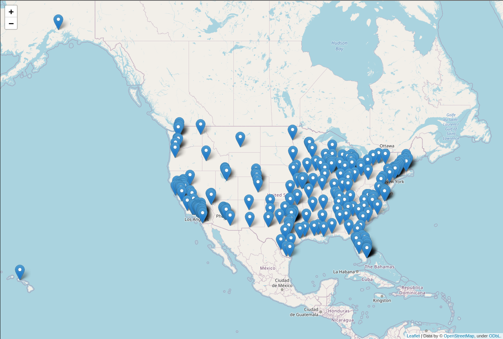
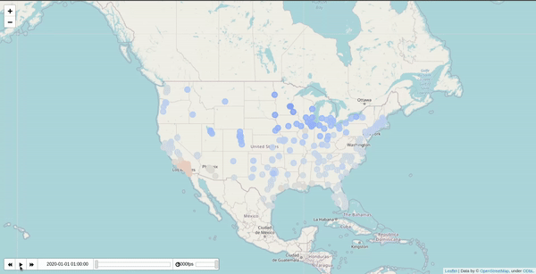

## Explanation
Inspired by my difficulty quickly making maps in python, I'm compiling examples of maps made using Folium. It'd be cool to make a Folium wrapper that makes generating maps in Python easier and add features like saving directly to a PNG.

The notebook defines two functions and shows how to manipulate data for them:

A) easy_map(): Given a list of coordinate tuples, plot markers on a centered map.

B) map_timestamped_GeoJson(): makes a TimestampedGeoJson map, using the GeoJSON format. 

These are daily temperatures for 280 US cities, based on 30 stations and using the inverse distance method. Deep blue is -20 C, and dark red is 40 C.

(GIF made by converting a WEBM from a screen recording using ezgif.com.)

### Data

Data comes from the Bill Perkin's temperature prediction challenge, see [this repository](https://github.com/LucDoh/bp_weather_challenge) for my solution and an explanation of the datasets. 